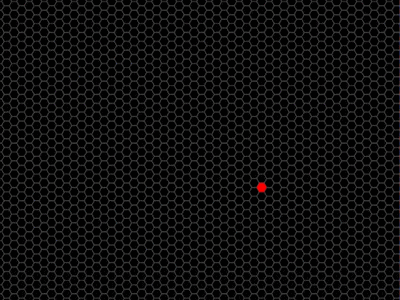

# antfarm
my first foray into cellular automata  
  

## capabilites
by default this program runs a single ant on a hex grid under rule: R1R2NUR2R1L2 however, it can easily be configured to run any other rule on a hexagonal grid.  
press `a` to spawn in another ant  
press `p` to pause (if you want to take a screenshot or something)
press `r` to clear the screen and create a new hex grid of random size
define a custom rule by changing line #18 in main.lua  
make it go much faster by changing `repN(tick, 1)` to `repN(tick, 20)` on line 100
